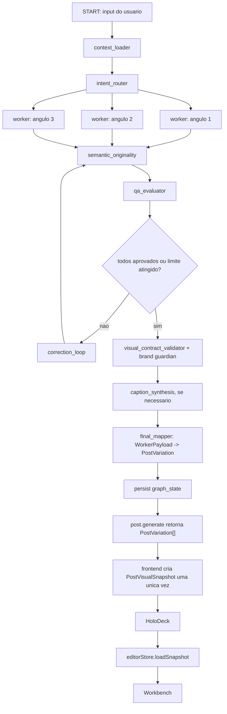

# Plano de implementacao: Pipeline High Ticket PostSpark

Data: 2026-07-07
Revisao: 1.1, apos verificacao contra o codigo atual.

Este plano define a implementacao sobria do pipeline High Ticket no PostSpark, preservando a arquitetura real do produto e tratando explicitamente o maior risco atual: drift entre o post exibido no HoloDeck e o post recebido pelo Workbench.

## Objetivo

Transformar o `post.generate` em uma geracao premium, coerente e auditavel, sem quebrar o contrato visual existente.

O pipeline High Ticket deve entregar:

- 3 abordagens estrategicas realmente diferentes, nao apenas reescritas superficiais.
- Cada abordagem como pacote atomico: copy, conceito visual, prompt de imagem, tokens visuais e estrutura de layout.
- Curadoria por BrandKit, Persona e Site Intelligence antes da geracao.
- QA antes de expor o resultado ao usuario.
- Avaliacao de originalidade semantica contra variacoes, Site Intelligence e historico recente.
- Estado operacional persistido em `postspark.generation_runs.graph_state`.
- Handoff visual fiel: o Workbench deve receber exatamente o mesmo `PostVisualSnapshot` aprovado no HoloDeck.

## Principio inegociavel: snapshot visual unico

O grafo High Ticket nao pode criar uma segunda fonte da verdade visual.

Fluxo canonico obrigatorio:

```text
WorkerPayload aprovado
  -> FinalMapper
  -> PostVariation
  -> createPostVisualSnapshot uma unica vez
  -> PostVisualSnapshot
  -> HoloDeck renderiza esse snapshot
  -> usuario seleciona esse mesmo snapshot
  -> editorStore.loadSnapshot(snapshot)
  -> Workbench renderiza/exporta/salva esse snapshot
```

`generation_runs.graph_state` guarda memoria operacional do grafo. Ele nao substitui `PostVisualSnapshot`, `editorStore.visualSnapshot` nem `postspark.posts.variation_snapshot`.

## Risco principal: drift de renderizacao

Problema observado:

- O HoloDeck mostra uma composicao.
- Ao selecionar, o Workbench recebe outra composicao ou recalcula partes do post.
- Refatoracoes em renderizacao/layout frequentemente quebram alinhamento, formatos, carrossel ou tokens.

Causas provaveis a evitar:

- Normalizar a mesma variacao mais de uma vez em pontos diferentes.
- HoloDeck aplicar `aspectRatio`, tema, familia criativa ou tokens localmente sem materializar isso no snapshot selecionado.
- Workbench rederivar layout a partir de campos legados depois de receber um snapshot.
- Renderers recalcularem `designTokens`, `layoutSettings`, `bgValue`, `bgOverlay` ou `aspectRatioOptimizations`.
- Slides de carrossel vazarem overrides para o documento base.
- O backend tentar produzir layout absoluto sem passar pelo contrato visual canonicamente testado.
- Remover `aspectRatioOptimizations` validas da geracao sem uma alternativa equivalente para troca de formato.

Plano de resolucao:

1. Criar um `VisualHandoffContract` documentado e testado: HoloDeck so pode chamar `onSelect` com `PostVisualSnapshot`, nunca com `PostVariation` crua.
2. Criar um teste de contrato HoloDeck -> Store -> Workbench: selecionar uma variacao deve preservar deep equality dos campos visuais criticos.
3. Garantir que `Home` nao normalize novamente o snapshot selecionado. Ele apenas troca `appState` para `workbench`.
4. Garantir que `editorStore.loadSnapshot(snapshot)` nao degrade campos ricos: `designTokens`, `layoutSettings`, `layoutSettingsByAspectRatio`, `sections`, `textElements`, `imageElements`, `slides[].editorState`, `bgValue` e `bgOverlay`.
5. Adicionar um `visualContractValidator` deterministico antes do HoloDeck para recusar payloads que provavelmente quebrariam diagramacao.
6. Adicionar fixtures de regressao para formatos `1:1`, `5:6`, `9:16`, static e carousel.
7. Antes de qualquer refatoracao visual futura, rodar obrigatoriamente os testes de snapshot/handoff.

## Topologia proposta



Observacao: no MVP, o `post.generate` pode continuar sincrono. A persistencia incremental em `generation_runs.graph_state` deve existir desde a primeira versao, mesmo sem polling no frontend.

## Fase 0: preparacao e invariantes

Objetivo: impedir que a nova arquitetura resolva IA e piore renderizacao.

Entregaveis:

- Confirmar schema remoto `postspark.brand_kits`, `postspark.personas` e `postspark.generation_runs.graph_state`.
- Registrar feature flag `AI_HIGH_TICKET_PIPELINE=false` em `server/_core/env.ts`.
- Definir `HIGH_TICKET_MAX_CORRECTION_ATTEMPTS=2` para MVP.
- Definir politica de falha do grafo: nao retornar 1-2 variacoes parciais; regenerar slots faltantes/reprovados e, se nao fechar 3 validas, falhar explicitamente ou acionar fallback legado apenas se houver feature flag especifica para isso.
- Definir que o pipeline High Ticket so entra depois de auth, validacao de input e regras de billing ja existentes.
- Criar checklist de contrato visual em teste antes da integracao com router.

Criterio de aceite:

- Feature flag desligada preserva 100% do comportamento atual.
- Nenhuma mudanca em HoloDeck/Workbench e feita sem teste de snapshot/handoff.

## Fase 1: tipos e schemas

Arquivos previstos:

- `shared/highTicket.ts`
- `shared/highTicketSchemas.ts`
- `server/ai/highTicket/types.ts`

Contratos compartilhados:

- `MasterBriefing`
- `BrandKitContext`
- `PersonaContext`
- `SiteIntelligenceContext`
- `IntentClassification`
- `AngleAssignment`
- `RouterOutput`
- `WorkerPayload`
- `OriginalityResult`
- `OriginalityAssessment`
- `QaResult`
- `GraphState`
- `GraphStatus`

Regras:

- `WorkerPayload` e um contrato interno do grafo, nao uma alternativa a `PostVariation`.
- `WorkerPayload` deve conter campos suficientes para mapear para `PostVariation`, mas nao deve conter `PostVisualSnapshot`.
- Schemas Zod devem validar payloads de LLM antes de qualquer persistencia ou renderizacao.
- `GraphState` deve ser serializavel em JSONB sem classes, funcoes ou valores nao deterministas.
- `GraphState` deve persistir `originality.assessments`, `originality.fallbackUsed` e referencias aos fingerprints persistidos.

Criterio de aceite:

- Testes de schema aceitam payload valido e rejeitam payloads sem copy, sem visual concept, sem angle, sem tokens minimos ou com estrutura de carousel invalida.

## Fase 2: acesso a dados e contexto

Arquivos previstos:

- `server/db.ts`
- `server/ai/highTicket/contextLoader.ts`
- `server/ai/highTicket/contextBudget.ts`

Responsabilidades:

- Buscar `brand_kits` por `user_uuid`.
- Buscar `personas` por `user_uuid`.
- Buscar Site Intelligence quando `siteIntelligenceId` estiver presente.
- Construir `MasterBriefing` com ordem de precedencia clara.
- Aplicar budget de contexto antes de enviar qualquer prompt a workers, roteador ou QA.

Precedencia recomendada:

1. Brief explicito do usuario.
2. ExecutionBrief, quando existir.
3. Site Intelligence persistida.
4. BrandKit.
5. Persona.
6. Defaults seguros.

Regras:

- O `context_loader` deve primeiro montar contexto deterministico e rastreavel.
- Se BrandKit + Persona + Site Intelligence + briefing ultrapassarem o budget definido, usar `high_ticket_context_summary` com modelo barato/rapido e output estruturado.
- A compressao deve preservar termos proibidos, termos obrigatorios, paleta, tom de voz, objeções, audiencia, evidencias fortes do site e CTA do briefing.
- O grafo deve persistir no `graph_state.context` quais partes foram truncadas, resumidas ou usadas integralmente.
- Fallback generico e permitido, mas deve ficar marcado em `graph_state.context.fallbacks`.

Criterio de aceite:

- Sem BrandKit/Persona, o pipeline ainda roda com defaults marcados.
- Com BrandKit/Persona, termos proibidos, tom e paleta aparecem no `MasterBriefing`.
- Com Site Intelligence grande, o `MasterBriefing` fica dentro do budget sem perder regras de marca obrigatorias.

## Fase 3: roteamento estrategico

Arquivo previsto:

- `server/ai/highTicket/intentRouter.ts`

Responsabilidade:

- Classificar o objetivo do usuario.
- Gerar 3 `AngleAssignment` ortogonais.
- Evitar tres variacoes semanticamente iguais.

Modelo recomendado:

- Modelo com raciocinio medio/alto, porque esta etapa define estrategia.
- Temperatura baixa/moderada.
- Output estruturado via schema.

Regras:

- Cada angulo deve ter tese, publico, mecanismo de persuasao, risco e restricoes visuais.
- O roteador deve justificar diferenca entre os tres angulos no `graph_state`, para debug.

Criterio de aceite:

- Teste garante tres angulos com `angleId` distintos e mecanismos distintos.
- Falha se dois angulos tiverem a mesma tese estrategica.

## Fase 4: workers atomicos

Arquivo previsto:

- `server/ai/highTicket/workers.ts`

Responsabilidade:

- Gerar em paralelo 3 pacotes completos, um por angulo:
  - headline
  - body
  - caption
  - hashtags
  - CTA
  - imagePrompt
  - visualConcept
  - designTokens sugeridos
  - template/sections ou slides
  - copyAngle/generationMeta

Regra central:

- Copy e visual nascem juntos no mesmo payload. Nao dividir legenda e layout em agentes independentes.

Modelo recomendado:

- Modelo premium balanceado para geracao estruturada.
- Raciocinio baixo/medio.
- Fallback para modelo menor apenas quando schema repair for suficiente.

Criterio de aceite:

- Cada worker retorna payload valido no schema.
- Carousel respeita quantidade de slides e roles.
- Static respeita limites de texto por formato.
- Nenhum worker retorna `PostVisualSnapshot`.
- Cada worker retorna suporte multi-formato suficiente: `aspectRatioOptimizations` validas para `1:1`, `5:6` e `9:16`, ou `layoutSettingsByAspectRatio` equivalente e testado contra `createPostVisualSnapshot`.

## Fase 4.5: originalidade semantica

Arquivos previstos:

- `server/ai/highTicket/semanticOriginality.ts`
- reutilizacao de `server/ai/semanticOriginality.ts`

Responsabilidade:

- Rodar `assessSemanticOriginality` apos os workers e antes do QA.
- Comparar candidatos entre si, contra evidencias do Site Intelligence e contra posts recentes.
- Alimentar `qaEvaluator` com `originalityScores`, mantendo a dimensao `originality` calibrada.
- Persistir fingerprints apos sucesso final, como o pipeline atual faz.
- Recalcular originality apos o `correction_loop` quando qualquer payload for alterado.

Regras:

- Originality nao e LLM judge; deve continuar deterministica/embedding-based.
- Falha de embedding nao deve derrubar a geracao automaticamente se o modulo atual retornar fallback; deve marcar `originalityFallbackUsed` no trace e no `graph_state`.
- Remover este no exigiria tambem remover/recalibrar a dimensao `originality` do QA, o que nao faz parte do MVP.

Criterio de aceite:

- QA recebe um score de originality por candidato.
- Revisoes recalculam originality antes de nova avaliacao.
- Fingerprints dos candidatos finais aprovados sao persistidos com `generationRunId`.

## Fase 5: QA, revisao e guardas visuais

Arquivos previstos:

- `server/ai/highTicket/qaEvaluator.ts`
- `server/ai/highTicket/correctionLoop.ts`
- `server/ai/highTicket/visualContractValidator.ts`
- reutilizacao ou absorcao explicita de `server/ai/brandVisualGuardian.ts`

QA semantico:

- Avaliar alinhamento com MasterBriefing.
- Avaliar consistencia copy-visual.
- Avaliar fit de plataforma.
- Avaliar originalidade usando os scores do no `semantic_originality`.
- Avaliar proibicoes de marca.
- Avaliar clareza, objecoes e CTA.

Revisor cirurgico:

- Recebe apenas payloads reprovados.
- Altera apenas campos reprovados.
- Mantem `angleId`, estrutura aprovada e partes boas.
- Maximo de 2 tentativas no MVP.

Guardas visuais deterministicos:

- Headline dentro de limite por formato.
- Body dentro de limite por formato.
- Carousel com slides validos e sem texto excessivo.
- `designTokens.colors` com valores validos.
- Contraste minimo estimado entre texto e fundo.
- `layout` compativel com `postMode`.
- `sections` com ids estaveis ou normalizaveis.
- `aspectRatioOptimizations`, quando vindas da geracao High Ticket, devem cobrir `1:1`, `5:6` e `9:16` com cores/layout validos.
- `aspectRatioOptimizations` so devem ser removidas em transformacoes locais que tornam o campo obsoleto, como troca de familia criativa, e sempre com teste de handoff.
- `layoutSettingsByAspectRatio`, se existir, deve cobrir apenas formatos validos e nao pode contradizer as otimizacoes por formato.
- `imagePrompt` coerente com visual concept.
- Regras deterministicas de paleta/contraste hoje cobertas pelo `brandVisualGuardian` devem ser preservadas, seja por reutilizacao direta, seja por migracao para o `visualContractValidator`.

Modelo recomendado:

- QA: modelo maior, raciocinio alto, temperatura baixa.
- Revisao: mesmo modelo dos workers ou modelo premium rapido, raciocinio baixo/medio.
- Visual contract: sem LLM.

Criterio de aceite:

- Payload que viola termo proibido e reprovado.
- Payload com texto longo demais e reprovado antes do HoloDeck.
- Payload com `aspectRatioOptimizations` ausentes/incompletas falha ou passa por reparo antes do HoloDeck.
- Payload reprovado passa por revisao sem reescrever os aprovados.
- O grafo termina com 3 aprovados ou falha de forma explicita.
- O grafo nunca entrega 1-2 variacoes parciais para o HoloDeck.

## Fase 6: final mapper e contrato visual

Arquivos previstos:

- `server/ai/highTicket/finalMapper.ts`
- testes em `server/ai/highTicket/finalMapper.test.ts`
- testes em `client/src/lib/variationSnapshot.test.ts`
- testes em `client/src/store/editorStore.test.ts`

Responsabilidade:

- Converter `WorkerPayload[]` aprovado em `PostVariation[]`.
- Nao gerar snapshot no backend.
- Nao inventar precedencia visual paralela.

Mapeamento minimo:

- `WorkerPayload.copy.headline` -> `PostVariation.headline`
- `WorkerPayload.copy.body` -> `PostVariation.body`
- `WorkerPayload.copy.caption` -> `PostVariation.caption`
- `WorkerPayload.copy.cta` -> `PostVariation.callToAction`
- `WorkerPayload.visual.imagePrompt` -> `PostVariation.imagePrompt`
- `WorkerPayload.visual.designTokens` -> `PostVariation.designTokens`
- `WorkerPayload.visual.template/sections/slides` -> campos correspondentes
- `AngleAssignment` -> `copyAngle` e `generationMeta.strategyId`

Teste obrigatorio de handoff:

```text
PostVariation High Ticket
  -> createPostVisualSnapshot
  -> HoloDeck seleciona snapshot
  -> editorStore.loadSnapshot(snapshot)
  -> editorStore.visualSnapshot
```

Campos que devem permanecer iguais apos handoff:

- `id`
- `headline`
- `body`
- `caption`
- `aspectRatio`
- `postMode`
- `designTokens`
- `layoutSettings`
- `layoutSettingsByAspectRatio`
- `bgValue`
- `bgOverlay`
- `sections`
- `textElements`
- `imageElements`
- `slides`
- `copyAngle`
- `generationMeta`

Criterio de aceite:

- Deep equality dos campos visuais criticos entre snapshot selecionado no HoloDeck e snapshot carregado no Workbench.
- Nenhum teste cria segundo normalizador.

## Fase 7: orquestrador e persistencia

Arquivos previstos:

- `server/ai/highTicket/graph.ts`
- `server/ai/highTicket/persist.ts`
- `server/ai/highTicket/index.ts`

Responsabilidade:

- Implementar state machine do grafo.
- Persistir `graph_state` apos cada etapa relevante.
- Retornar resultado compativel com `PostGenerationResult`.

Estados minimos:

- `created`
- `context_loaded`
- `context_compressed`
- `routed`
- `workers_completed`
- `originality_completed`
- `qa_completed`
- `revision_completed`
- `visual_contract_validated`
- `caption_synthesized`
- `mapped`
- `completed`
- `failed`

Persistencia:

- Criar ou atualizar `postspark.generation_runs`.
- Atualizar `graph_state` incrementalmente.
- Preencher `spark_cost` quando integrado ao custo real.
- Preencher `completed_at` ao concluir.

Criterio de aceite:

- Em falha, `generation_runs.graph_state` preserva ultimo estado util.
- Em sucesso, `graph_state.output.variations` ou resumo tecnico permite debug sem substituir `variation_snapshot`.
- Se 0, 1 ou 2 workers forem aproveitaveis, o grafo tenta reparo/regeneracao por slot antes de encerrar.
- Se ainda nao houver exatamente 3 variacoes aprovadas, o grafo nao retorna parcial: registra `failed` e lança erro controlado, ou aciona fallback legado apenas se uma flag explicita permitir.

## Fase 8: integracao com `post.generate`

Arquivos previstos:

- `server/routers.ts`
- `server/_core/env.ts`

Regra de integracao:

```text
auth existente
  -> validacao existente
  -> billing existente
  -> if ENV.aiHighTicketPipelineEnabled
       runHighTicketPipeline(input)
     else
       pipeline atual
```

Regras:

- Nao duplicar debito de Sparks.
- Nao alterar payload publico quando flag estiver off.
- `PostGenerationResult` deve continuar contendo `variations` e `generationRunId`.
- `debug` deve incluir rastros High Ticket quando `debug=true`.
- Provider retry, schema repair e fallback Gemini continuam centralizados em `invokeLLM`; o grafo deve tratar apenas falhas de nivel de orquestracao, slot e QA.
- Fallback para o pipeline legado, se adotado, deve ser controlado por flag separada e registrado no `graph_state`, para nao mascarar falhas High Ticket.

Criterio de aceite:

- Flag off: testes existentes passam sem diferenca.
- Flag on: retorna 3 `PostVariation[]` validas e normalizaveis.
- Flag on com falha total: nao debita/retorna comportamento ambiguo sem politica explicita documentada no teste.

## Fase 9: frontend e prevencao definitiva do drift

Arquivos provaveis:

- `client/src/pages/Home.tsx`
- `client/src/components/views/HoloDeck.tsx`
- `client/src/store/editorStore.ts`
- `client/src/lib/variationSnapshot.ts`
- `client/src/components/PostRenderer.tsx`
- `client/src/components/views/WorkbenchV2/WorkbenchV2.tsx`

MVP:

- Nenhuma mudanca obrigatoria de tela.
- Continuar convertendo `result.variations` em `PostVisualSnapshot[]` ao entrar no HoloDeck.
- HoloDeck deve passar o snapshot efetivamente renderizado para o Workbench.

Melhoria recomendada:

- Introduzir um `handoffId` no snapshot em memoria, calculado a partir de hash estavel dos campos visuais criticos.
- Em dev/test, logar erro se o hash do snapshot no HoloDeck divergir do hash carregado no Workbench.
- Criar teste de regressao para troca de aspect ratio antes da selecao.
- Criar teste de regressao para aplicacao de tema/familia criativa antes da selecao.
- Criar teste de regressao para imagem sintetizada no HoloDeck antes da selecao.

Criterio de aceite:

- O Workbench abre exatamente o snapshot selecionado.
- Se o usuario muda tema, familia criativa, formato ou imagem no HoloDeck, a mudanca selecionada entra no snapshot carregado.
- Exportacao e salvamento leem `editorStore.visualSnapshot`.

## Fase 10: estrategia de modelos

Rotas recomendadas:

- `context_loader`: deterministico; quando o budget exigir, modelo rapido com output estruturado para `high_ticket_context_summary`.
- `intent_router`: modelo forte com raciocinio medio/alto.
- `workers`: modelo premium balanceado, raciocinio baixo/medio.
- `semantic_originality`: embeddings, sem LLM judge.
- `qa_evaluator`: modelo maior, raciocinio alto, temperatura baixa.
- `correction_loop`: modelo dos workers ou modelo premium rapido, raciocinio baixo/medio.
- `caption_synthesis`: manter como etapa explicita se os workers nao conseguirem garantir coerencia legenda-visual no primeiro MVP; modelo rapido/medio com output estruturado.
- `visual_contract_validator`: sem LLM.
- `future_vision_qa`: modelo multimodal forte, somente depois do MVP.

Configuracao recomendada:

- Adicionar rotas especificas ao `AiTaskRoute`, por exemplo:
  - `high_ticket_intent_router`
  - `high_ticket_worker`
  - `high_ticket_qa`
  - `high_ticket_revision`
  - `high_ticket_context_summary`
  - `high_ticket_caption_synthesis`
- Mapear modelos por rota em `server/ai/modelRouter.ts`.
- Nao deixar a selecao historica `AiModel = "gemini" | "llama"` decidir o modelo premium do pipeline High Ticket.

Criterio de aceite:

- Cada chamada registra `taskRoute`, modelo efetivo, custo estimado e latencia no trace.
- Originality registra embeddings/fallback separadamente do trace de LLM.
- QA usa modelo mais criterioso que microcopy/geracao barata.

## Fase 11: testes obrigatorios

Backend:

- `shared/highTicketSchemas.test.ts`
- `server/ai/highTicket/contextLoader.test.ts`
- `server/ai/highTicket/intentRouter.test.ts`
- `server/ai/highTicket/workers.test.ts`
- `server/ai/highTicket/semanticOriginality.test.ts`
- `server/ai/highTicket/qaEvaluator.test.ts`
- `server/ai/highTicket/correctionLoop.test.ts`
- `server/ai/highTicket/visualContractValidator.test.ts`
- `server/ai/highTicket/finalMapper.test.ts`
- `server/ai/highTicket/graph.test.ts`
- `server/post.generate.highTicket.test.ts`
- teste de fallback: 0 workers validos
- teste de fallback: 1-2 workers validos
- teste de recalculo de originality apos revisao
- teste de `aspectRatioOptimizations` completas para `1:1`, `5:6`, `9:16`

Frontend/contrato visual:

- `client/src/lib/variationSnapshot.test.ts`
- `client/src/store/editorStore.test.ts`
- teste novo de handoff HoloDeck -> Workbench
- fixture static `1:1`
- fixture static `5:6`
- fixture story `9:16`
- fixture carousel com `slides[].editorState`
- fixture com `sections`
- fixture com `textElements` e `imageElements`

Browser/manual antes de liberar:

- Gerar post static e abrir no Workbench.
- Gerar carousel e alternar slides.
- Mudar aspect ratio no HoloDeck e selecionar.
- Aplicar tema visual no HoloDeck e selecionar.
- Sintetizar imagem no HoloDeck e selecionar.
- Salvar e reabrir post salvo.
- Exportar PNG e comparar visualmente.

## Fase 12: rollout

Passo 1: schema e docs ja preparados.

Passo 2: implementar tipos, schemas e validators sem tocar no router.

Passo 3: implementar grafo com chamadas mockaveis.

Passo 4: rodar pipeline em teste isolado com fixtures.

Passo 5: integrar ao `post.generate` atras de `AI_HIGH_TICKET_PIPELINE=false`.

Passo 6: ativar em ambiente local/staging para usuario interno.

Passo 7: medir:

- taxa de sucesso do schema
- taxa de revisao do QA
- taxa de fallback/context compression
- taxa de originality fallback
- tempo total por geracao
- custo por run
- numero de falhas por layout guard
- divergencias de handoff HoloDeck -> Workbench

Passo 8: ativar gradualmente em producao.

## Criterios finais de sucesso

Produto:

- Usuario recebe 3 abordagens estrategicas diferentes.
- Conteudo respeita tom, persona, termos proibidos e identidade visual.
- QA bloqueia saidas fracas antes do HoloDeck.

Tecnico:

- Feature flag off preserva o pipeline atual.
- Feature flag on retorna `PostVariation[]` compativel.
- `generation_runs.graph_state` registra o caminho completo do grafo.
- Originality semantica continua alimentando QA e fingerprints.
- `graph_state` nao invade o contrato visual.
- Workbench recebe exatamente o snapshot renderizado no HoloDeck.

Renderizacao:

- Nenhuma regressao em static/carousel.
- Nenhuma perda de formato `1:1`, `5:6`, `9:16`.
- `aspectRatioOptimizations` High Ticket sao completas e validas, ou existe substituto equivalente testado no normalizador canonico.
- Nenhum renderer recalcula tokens/layout/background por conta propria.
- Salvamento, exportacao e historico seguem usando `editorStore.visualSnapshot`.

## Ordem recomendada de implementacao

1. `shared/highTicket.ts` e `shared/highTicketSchemas.ts`.
2. `visualContractValidator`, politica de `aspectRatioOptimizations` e testes.
3. Teste de handoff HoloDeck -> Workbench antes de mudar a geracao.
4. `contextLoader` e `contextBudget`.
5. `intentRouter`.
6. `workers`.
7. `semanticOriginality`.
8. `qaEvaluator` e `correctionLoop`.
9. `captionSynthesis`, se mantido separado no MVP.
10. `finalMapper`.
11. `graph` e `persist`.
12. Rotas de modelo High Ticket.
13. Integracao com `post.generate` por feature flag.
14. Validacao manual e browser.

Esta ordem reduz risco porque congela primeiro o contrato visual que nao pode quebrar, depois implementa a inteligencia do grafo.
