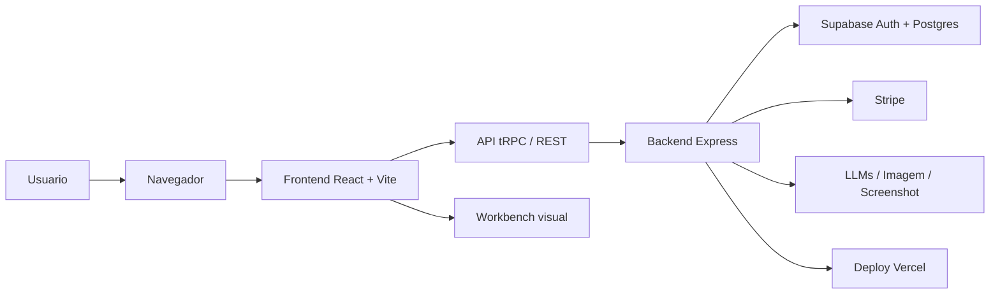
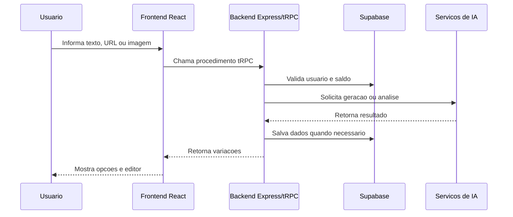
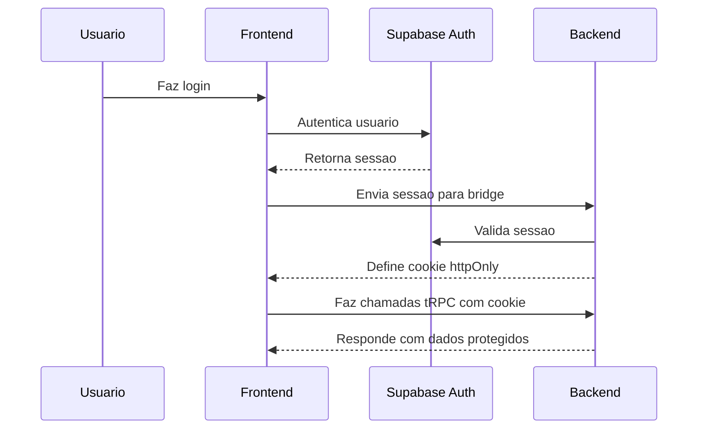
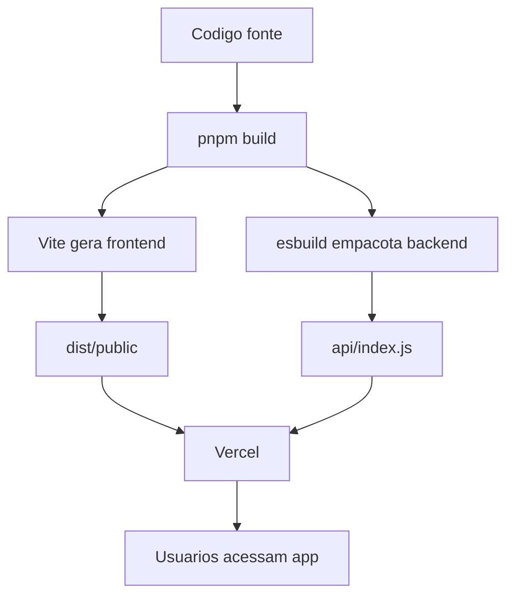
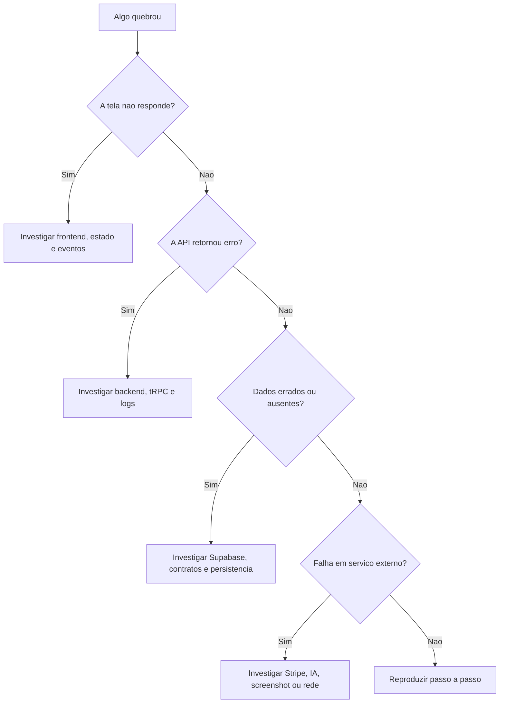

# Diagramas

Estes diagramas podem ser usados para explicar o PostSpark 3 em aulas, revisoes ou conversas.

## Arquitetura macro

## Fluxo de geracao

## Autenticacao

## Build e deploy

## Onde investigar problemas

